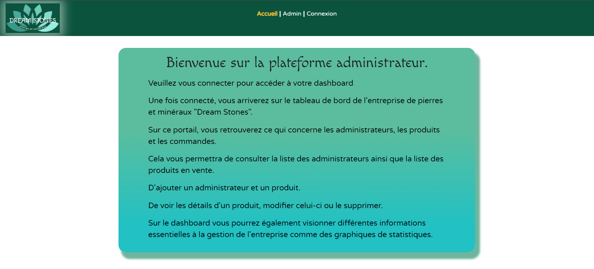

# Dream Stones Dashboard

Bienvenue sur le dashboard de l'entreprise Dream Stones, réalisé avec le framework Vue.js.

## Contexte du Projet

Ce projet vise à fournir un tableau de bord interactif pour l'entreprise Dream Stones, permettant de visualiser et d'analyser des données pertinentes pour son activité.

## Configuration du Projet

Avant de démarrer le projet, veuillez suivre ces étapes :

1. **Importation de la base de données** :
   Assurez-vous d'importer la base de données disponible dans le dossier 'database' dans votre système de gestion de bases de données et de configurer le fichier backend 'server.js' avec vos identifiants de base de données.

2. **Démarrage du Serveur Backend** :
   Accédez au dossier backend dans votre terminal :
cd dream_stones-backend/

    Démarrer le serveur backend en exécutant la commande :
node server.js

3. **Démarrage du Serveur Local** :
Accédez au dossier principal du projet et démarrez le serveur local en exécutant la commande :
npm run serve

## Lien vers le Dépôt Docker Hub

L'image Docker de ce projet est disponible sur Docker Hub à l'adresse suivante :
[ln27100/dream_stones_image](https://hub.docker.com/repository/docker/ln27100/dream_stones_image)

Pour tirer cette image Docker localement, exécutez la commande suivante dans votre terminal :
docker pull ln27100/dream_stones_image

Une fois que vous avez tiré l'image Docker, vous pouvez exécuter un conteneur en utilisant la commande suivante :
docker run -p 8080:8080 ln27100/dream_stones_image

## Configuration du Projet
Pour installer les dépendances du projet, exécutez la commande suivante :
yarn install

### Compilation et rechargement à chaud pour le développement
yarn serve

### Compilation et minification pour la production
yarn build

Pour plus de détails sur la configuration du projet, consultez la [Référence de Configuration](https://cli.vuejs.org/config/).

